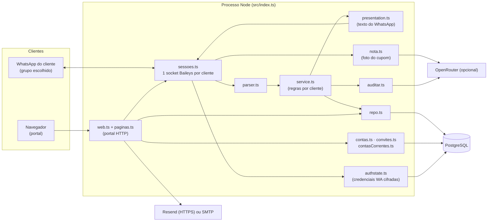
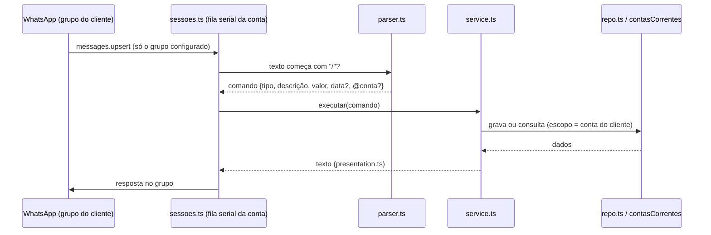

# Arquitetura do WCOEN

Como o sistema está montado hoje. O uso (comandos e operação) está no [README](../README.md). A spec de cada
funcionalidade está em `docs/superpowers/specs/`.

## Visão geral

É um processo só. Ele mantém as sessões do WhatsApp de todos os clientes conectados (até `MAX_SESSOES`, padrão
20) e serve o portal na `PORTA` (padrão 3000). Não há build: o TypeScript roda direto com `tsx`, tanto em
desenvolvimento quanto no `Dockerfile`.

## Ordem de inicialização (`src/index.ts`)

1. `loadConfig()` lê e valida o `.env` e conecta ao Postgres. Se a conexão falha, encerra com uma mensagem clara.
2. Cria os repositórios. Cada um garante as próprias tabelas (`CREATE TABLE IF NOT EXISTS` + `ALTER ... ADD
   COLUMN IF NOT EXISTS`), então não há ferramenta de migração separada. A ordem importa: `contasCorrentes`
   migra os lançamentos antigos para a conta "Principal" e por isso vem depois de `repo`.
3. Liga, se configurados, o mailer (Resend tem prioridade sobre SMTP), o auditor (`OPENROUTER_API_KEY` +
   `OPENROUTER_MODEL`) e o extrator de nota (`OPENROUTER_VISION_MODEL`).
4. Cria `sessoes` e o portal (`web`) e reabre, de forma escalonada, as sessões que estavam conectadas antes do
   reinício.
5. Rotinas: a cada hora, desconecta as contas com a validade vencida. A cada 10 minutos, se houver `DOMINIO`,
   faz um auto-ping em `/saude` (evita a hibernação do Render gratuito).

## Módulos

| Módulo | Responsabilidade |
|---|---|
| `sessoes.ts` | Ciclo de vida de cada sessão do WhatsApp: QR ou código de pareamento, escolha do grupo, reconexão com backoff exponencial (`backoff.ts`, até 60 s) e recuperação das mensagens recebidas offline. Cada cliente tem uma **fila serial**: uma mensagem por vez, na ordem de chegada. A leitura de nota e a IA ficam fora dessa fila, para não travar os outros comandos. O erro de uma conta nunca derruba as outras. |
| `baileys.ts` | Adaptador fino do `@whiskeysockets/baileys`. Os testes usam um socket falso com o mesmo contrato. |
| `authstate.ts` | Mesmo contrato do `useMultiFileAuthState` do Baileys, mas no Postgres (`wa_auth`), por conta, cifrado com AES-256-GCM (`CHAVE_CRIPTO`). Nunca devolve `null` para credenciais existentes, para o Baileys não gerar credenciais novas por cima. |
| `parser.ts` | Converte a mensagem em comando. Só vale texto que começa com `/`. Lê a data opcional (`dd/mm` ou `dd/mm/aaaa`) e o `@apelido` da conta corrente, em qualquer posição. |
| `service.ts` | Regras de negócio de um cliente: lançar, desfazer (com dedupe por `msgId` em memória), balancete (dia, semana, mês, ano), extrato paginado, contas, transferências e auditoria. A transferência não é receita nem despesa: fica fora dos totais e da auditoria. |
| `presentation.ts` | Só monta o texto do WhatsApp (negrito, itálico, emojis). Não calcula nem acessa dados. |
| `period.ts` / `money.ts` | Períodos com o fuso fixo de −03:00 (o Brasil não tem horário de verão desde 2019) e dinheiro em centavos (`BIGINT`). |
| `auditar.ts` | Dicas da IA na `/auditoria`: até 5 sugestões, só texto. Os números vêm do bot. Tenta os modelos de `OPENROUTER_MODEL` em ordem. |
| `nota.ts` | `/nota`: a IA com visão transcreve total, data e emitente. O resultado é validado e vira uma prévia com o comando pronto, que o `/ok` lança. A foto não é guardada. As requisições exigem `data_collection: deny`. Limite de 20 fotos por hora por conta. |
| `repo.ts` | `lancamentos` no Postgres (com o contrato `Repositorio`). Tem uma implementação em memória nos testes, validada pelo mesmo `repo.contract.ts`. |
| `contas.ts` | Contas do portal: cadastro com convite, login, papéis (`admin`, `usuario`, usuário com validade), desativação, redefinição de senha e um limitador de tentativas (5 a cada 15 minutos). |
| `convites.ts` | Convites de uso único criados no `/admin`. O `CONVITE` do `.env` é o plano B, multiuso. |
| `contasCorrentes.ts` | Contas correntes por cliente: apelido fixo, favorita, saldo inicial e desativação (nunca exclusão). Migração idempotente para a conta "Principal". |
| `dashboard.ts` | Indicadores do `/dashboard`: saldo, receitas e despesas do mês com a variação, tendência de 6 meses e despesas por categoria. |
| `web.ts` / `paginas.ts` | Portal HTTP (`node:http`) com HTML gerado no servidor e o Trade UI (tokens inline e fontes em `/ds/*`). Rotas: `/`, `/saude`, `/cadastro`, `/entrar`, `/sair`, `/esqueci-senha`, `/redefinir-senha`, `/painel` (conexão do WhatsApp e escolha do grupo), `/dashboard`, `/contas-correntes`, `/perfil` e `/admin`. |
| `mailer.ts` | E-mail de redefinição de senha pelo Resend (API HTTPS, porque o Render gratuito bloqueia SMTP) ou por SMTP (`nodemailer`). Sem nenhum dos dois, o link só é registrado no log. |
| `config.ts` / `db.ts` | Validação do `.env` e pool do `pg`. Com `?sslmode=require`, o TLS é montado à mão: o driver descartaria o `rejectUnauthorized: false` exigido pelo Supabase. |
| `cli/senha.ts` | `npm run senha -- email nova-senha` (operação). |

## Fluxo de uma mensagem

- **Isolamento por cliente:** toda consulta e gravação é feita pelo `contaId` da sessão (`repo.repoDe(id)`,
  `contasCorrentes.doCliente(id)`). Nem o admin vê valores de outras contas no portal.
- **Nota por foto:** imagem com a legenda `/nota` → download (5 MB no máximo, 30 s de timeout) → IA com visão →
  validação → prévia. Em seguida, `/ok` ou a resposta citando a prévia lança o lançamento. A prévia vale 30
  minutos e só fica em memória.
- **Auditoria:** os totais, o ranking e a comparação são calculados pelo bot. A IA só escreve as dicas (pode
  levar até ~45 s).

## Modelo de dados (PostgreSQL)

| Tabela | Conteúdo |
|---|---|
| `contas` | Clientes do portal: e-mail, `senha_hash`, grupo do WhatsApp, `conectada`, `ativa`, `papel`, `validade_ate`, nome e avatar. |
| `logins` | Sessões do portal (cookie `sid`, com expiração). |
| `redefinicoes_senha` | Tokens de redefinição, com expiração. |
| `convites` | Convites de uso único (código, nota, quem criou e quem usou). |
| `lancamentos` | Receitas, despesas e transferências: `conta_id` (cliente), `tipo`, `conta` (a descrição/categoria digitada, ex.: "mercado"), `valor` em centavos, `data`, `enviado_em`, `msg_id`, `desfeito_em`, `conta_corrente_id` e `conta_destino_id`. |
| `contas_correntes` | Contas de cada cliente: `apelido` (único por cliente), nome, `saldo_inicial`, `favorita` e `ativa`. |
| `wa_auth` | Credenciais e chaves do Baileys por conta, **cifradas** (AES-256-GCM). |

Valores sempre em centavos (`BIGINT`). O saldo de uma conta corrente é o saldo inicial mais as receitas,
menos as despesas, mais ou menos as transferências.

## Segurança

- **Credenciais do WhatsApp** cifradas no banco, com a chave (`CHAVE_CRIPTO`) fora dele. Sem a chave, as
  sessões gravadas não abrem.
- **Portal:** cookie `HttpOnly`, `SameSite=Lax` e `Secure` quando há `DOMINIO`. CSP restritiva
  (`default-src 'self'`, `frame-ancestors 'none'`). Todo POST só é aceito com `Origin` do próprio host.
  Limitador de tentativas no login, no cadastro e na redefinição de senha.
- **Cadastro fechado**, por convite. Admins fixos por `ADMIN_EMAILS`, que não podem ser rebaixados pelo menu.
- **Validade de acesso** vale até o fim do dia escolhido, no fuso de São Paulo. Depois disso o login é barrado,
  as sessões caem e o WhatsApp é desconectado.
- **IA:** só com modelos pagos e explícitos, sem modelo gratuito de reserva. A leitura de nota exige
  provedores com `data_collection: deny`. A IA nunca grava nem calcula.
- **Postgres** no compose só em loopback (`127.0.0.1:5432`) para desenvolvimento, e sem exposição externa em
  produção.

## Implantação

| Opção | Componentes |
|---|---|
| **Servidor próprio** | `docker compose up -d`: `app` (Dockerfile, Node 22) + `postgres:16-alpine` + `caddy:2` (HTTPS automático para `DOMINIO`, `reverse_proxy app:3000`). |
| **Render (gratuito) + Supabase** | `render.yaml` (Blueprint, Docker, `healthCheckPath: /saude`). As variáveis são pedidas na criação. Banco Supabase com `?sslmode=require`. O auto-ping evita a hibernação. |
| **Local (dev)** | `docker compose up -d postgres` + `npm start` (`node --env-file=.env --import tsx src/index.ts`). |

## Testes

`npm test` (Vitest), com um Postgres local num banco separado (`wcoen_test`), recriado a cada execução.
Há testes por módulo: parser, período, dinheiro, apresentação, service, sessões (com um socket falso),
authstate, contas, convites, contas correntes, dashboard, nota, auditoria, mailer, web e páginas. O contrato do
repositório (`repo.contract.ts`) roda contra o Postgres e contra a implementação em memória.
`npm run test:paginas` gera e confere as páginas do portal, e `npm run typecheck` roda o `tsc --noEmit`.
